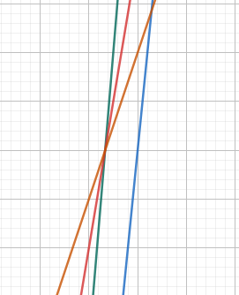
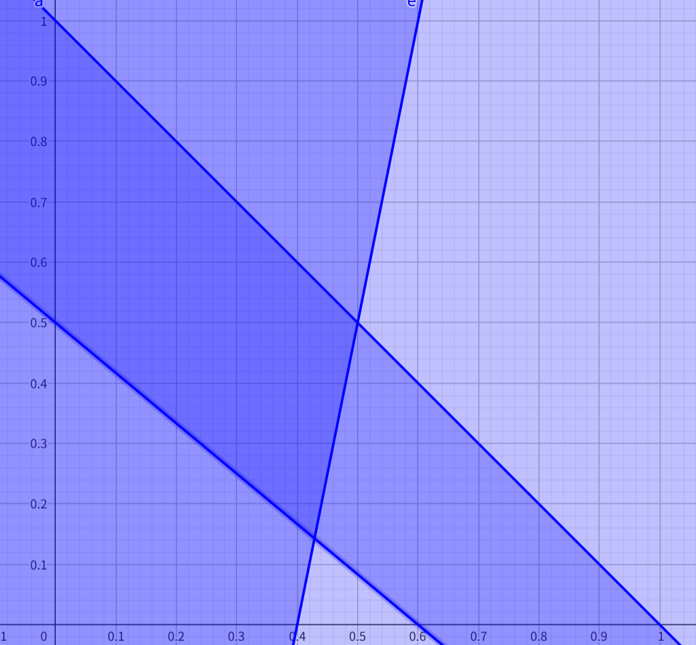
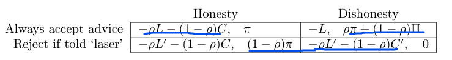
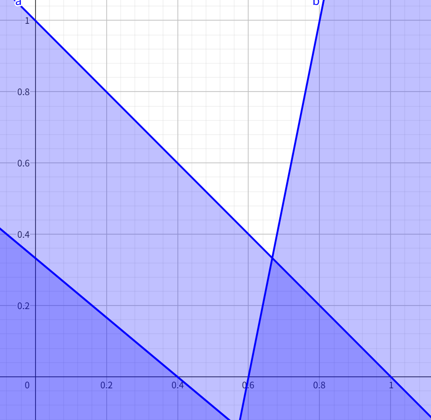
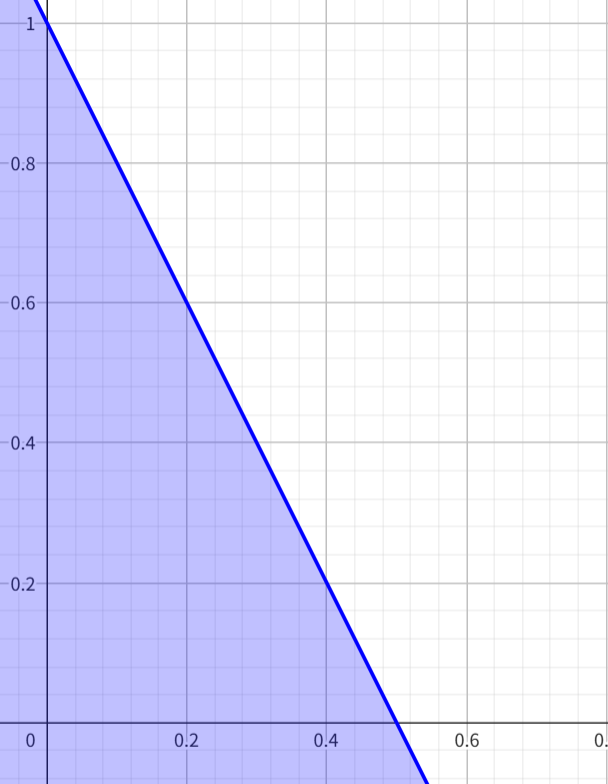

### 1
(a) 没有劣势策略
(b) 
1.  
当 belief 为 $ \beta = (a, b, 1-a-b)$ 时，
$\mathrm{payoff}(l)_{\beta} = 5a + 3b + 1$
$\mathrm{payoff}(m)_{\beta} = 4b + 3$
$\mathrm{payoff}(r)_{\beta} = 6 - 5a - 2b$

当 $\mathrm{payoff}(m)$ 最大时，可得如下图

<!--  -->

2.  
当 belief 为 $ \beta = (a, b, 1-a-b)$ 时，
$\mathrm{payoff}(L)_{\beta} = 9 - 5a - 2b$
$\mathrm{payoff}(M)_{\beta} = 6 - 3b$
$\mathrm{payoff}(R)_{\beta} = 5a + 3b + 4$

当 $\mathrm{payoff}(M)$ 最大时，可得如下图
<!--  -->

所以不可能

(c)
因为 player1 不可能选择 $M$，所以只有 $L$ 和 $R$ 可能。当 
$$\mathrm{payoff}(L)_{\beta} \geq \mathrm{payoff}(R)_{\beta}$$ 
可得如下图 

故 player1 等概率选择 $L$ 和 $R$。（没啥用）
当 player1 只能选择 $L$ 或 $R$ 时，可得当 $m$ 是 best response 时，

$$ \frac{3}{2}b \leq a \leq \frac{2}{3}b$$
所以永远都不可能选择 $m$。
~~在此情况下，player2 选择 $M$ 的收益为 3，其它的收益都是 3.5，所以不应该选择 $M$。~~

(d)
因为任意 profile，都能找到更优的 profile，所以没有均衡。

### 2
(a)
当两个合伙人的投入相同都为 $s$ 时，可得最终的净利润为

$$u(s) = 8s + (4b - 2) s^2$$

导数为 $u'(s) = 8b + 4 > 0$，故 $s = 4$

与课堂上的结果比较，可得当不存在竞争?时，投入越大越好。

(b)
当 $s_2 = 4$ 时，partner1 的收益为 $$u(s_1) = 8 + (8b + 2) s_1 - s_1^2$$

导数为 

$$u'(s_1) = 8b + 2 - 2s_1$$

故当 $s_1 = 4b + 1$ 时，收益最大

所以 $s_1* < s_1 < s_1^{**}$

(c)
此时 $s^* = \frac{2}{3}$
因为 $u'(s) = 8b + 4 = 0$，所以任意取即可？

### 2 redo
(a) 

当两个合伙人的投入相同都为 $s$ 时，可得最终的净利润为

$$u(s) = 8s + (4b - 2) s^2$$

导数为 $u'(s) = 8 + 4(2b-1)s $，故当 $s = \frac{2}{1-2b}$ 时最优

(b)

当 $s_2 = \frac{2}{1-2b}$ 时，partner1 取 $s_1 = \frac{1}{1-2b}$ 最优

因为 $s^* = \frac{1}{1-b},s^{**} = \frac{2}{1-2b}$

(c)

此时 $s^* = \frac{2}{3}$

### 3

(a)
第一轮：
B 是严格劣势策略，去掉 B
||L|C|R|
|-|-|-|-|
|**T**|2,0|1,1|4,2|
|**M**|3,4|1,2|2,3|

第二轮：
C 是严格劣势策略，去掉 C
||L|R|
|-|-|-|
|**T**|2,0|4,2|
|**M**|3,4|2,3|

(b)
纳什均衡：(M, L)， **(T, R)**
**NOTE**：**纳什均衡 playeri 的 payoff 只需要跟自己的其它策略比，不需要考虑对方策略变化的 payoff**

(c)
纳什均衡策略得满足 player1 在同一列内最优，player2 在同一行内最优，故不可能被 strictly dominate。当然可以被 weakly dominate

### 4
(a)
最直接的纳什均衡是 $(a,b), a + b = 10$

(b)
~~纳什均衡是 $(a, b) , a = b , 5 \leq a, b \leq 10$~~
得考虑小数情况，故纳什均衡是 
$$(5.00, 5.00), (5.00, 5.01), (5.01, 5.00), (5.01, 5.01)$$

(c) 
~~不会~~
会的，新的纳什均衡是
- a:现在是有限的
- b:$$(5, 5), (5, 6), (6, 5), (6, 6)$$