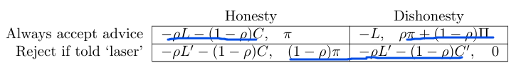

### 1
(a)
pure strategy:没有纯策略的纳什均衡
mixed strategy: 令 payoff 相等
$$(U = \frac{6}{13}, D = \frac{7}{13}), (l = \frac{1}{8}, r = \frac{7}{8})$$

(b) 
pure strategy:没有纯策略的纳什均衡
mixed strategy: 令 payoff 相等
$$(U = \frac{4}{11}, D = \frac{7}{11}), (l = \frac{1}{8}, r = \frac{7}{8})$$

(c)
player2 的 payoff 改变并不影响自己的纳什均衡

### 2
(a)
$p(x) = p$，001 的 payoff 如下
$$
a: 12p \\
b: 10p + 1 \\
c: 6p + 4 \\
d: 3p + 6 \\
$$

所以 BR 如下：
$$
\begin{cases}
d & 0 \leq p < \frac{2}{3}\\
a, c, d & p = \frac{2}{3} \\
a & \frac{2}{3} < p < 1
\end{cases}
$$

(b)
一定不选 b ，因为 b 永远不是 BR

(c)
能找到一个
$$
(c), (x = \frac{2}{3}, y = \frac{1}{3})
$$

还能找到另一个：
$$
(a = \frac{1}{3}, d = \frac{2}{3}), (x = \frac{2}{3}, y = \frac{2}{3})
$$

所以有很多个：
$$
(a = \alpha, c = 1 - 3\alpha, d = 2\alpha), (x = \frac{2}{3}, y = \frac{1}{3})
$$

### 3
(a)
因为若需要大修，但 expert 选择了小修，那么 expert 会坐牢，所以她不可能撒谎
但是因为小修报大修能赚到钱，所以 expert 可能会撒谎

(b)
trivial

(c)
因为 BR 刚好全部错开了

intuition：当 $L > \rho L' + (1 - \rho C')$，代表顾客可能会选择咨询
？？？？？

(d)
player2/expert 的 $P(Honesty) = p$，则可得
$$
p = \frac{\rho L' + C' - C'\rho - L}{\rho L - L + C' - C' \rho}
$$

player1 的 $P(A) = q$，则可得
$$
q = \frac{\pi}{\Pi}
$$

(e)
L 变大，那么 $payoff(A)$ 变小，则 $P(Honesty)$ 需要变大，才能让 $payoff(A) = payoff(R)$

L 变大，不影响 player1 的均衡点

intuition：还是得结合公式

(f)
$\Pi$ 变大，那么 player2 不影响

$\Pi$ 变大，根据公式可得 $q$ 变小。

intuition：$\Pi$ 变大，那么右上角值变大，那么 $payoff(D)$ 变大，所以我们需要让 $q$ 变小，才能让 $payoff(D) = payoff(H)$

(g)
intuition：
$\rho$ 变大，那么 $payoff(R) > payoff(A)$，所以需要增大 $p$；
反之，当 $\rho$ 变小，那么 $payoff(R) < payoff(A)$，所以需要减小 $p$；
